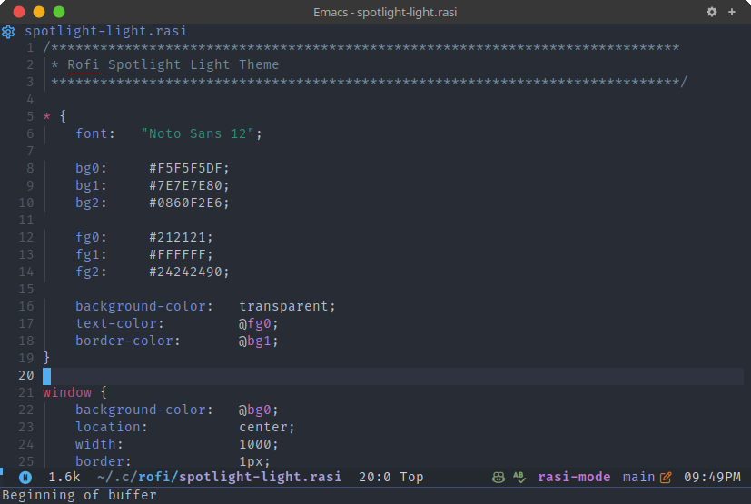

# rasi-mode

Emacs major mode for editing the [RASI configuration file format of Rofi](https://davatorium.github.io/rofi/CONFIG/).

## Screenshot

## Installation

- Automatic package installation from [Melpa](https://melpa.org/).

## Features

### Supported

- Syntax highlighting.
- Automatic code indentation.

### Todo

- [ ] Code outline via Imenu
